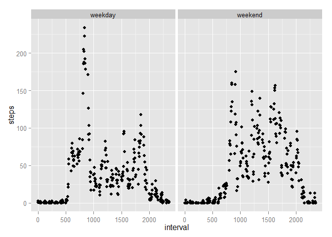

# Peer Assessment 1 - ReproRes
Nick Switzer  
Monday, November 10, 2014  

<b>1. Loading and Preprocessing the data</b>

First, we load the activity data into a dataframe using the read.csv() command. The only processing necessary is to convert the date column into date objects instead of factors. This will allow for better date processing later. 

In my opinion, the column names are already human-readable. 


```r
  library(knitr)
```

```
## Warning: package 'knitr' was built under R version 3.0.3
```


```r
actData <- read.csv("C:/Users/nswitzer/Documents/Activity Monitoring Data/activity.csv")

actData$date <-as.Date(actData$date,format="%Y-%m-%d")
```

<b>2.What is the mean total number of steps taken per day?</b>

In order to answer this question, the data must be aggregated by date. 


```r
daySum <- aggregate(steps~date,sum,na.rm=TRUE, data=actData)

##Histogram of totals per day

hist(daySum$steps)
```

 

```r
dayMedian <- (median(daySum$steps))
dayMean <- (mean(daySum$steps))
```

Voila! The median steps in a day is 10765 and the mean steps per day is 1.0766189\times 10^{4}.

<b>3. What is the average daily activity pattern</b>


```r
intervalMean <- aggregate(steps~interval,mean,na.rm=TRUE, data=actData)

plot(intervalMean$interval,intervalMean$steps,type="l")
```

 

```r
##Get max interval

maxInterval <- (subset(actData,steps == max(steps,na.rm=T)))
```

The interval with the maximum average steps is 615 at 806 steps.

<b>4. Imputing Missing Values</b>

There are many missing values. We will count them and replace them with the median. More sophisticated methods are available for replacement, but that is not required for this project. 


```r
##Count missing

missingVals <- sum(is.na(actData$steps))

##Impute missing values

actDataFilled <- actData

actDataFilled$steps[is.na(actDataFilled$steps)] <- median(actDataFilled$steps,na.rm=T)

#Count missing values again

daySumFilled <- aggregate(steps~date,sum,na.rm=TRUE, data=actDataFilled)

hist(daySumFilled$steps)
```

 

There were 2304 NA values counted before replacement with the median.

The new histogram shows that many low values were imputed (when compared to the first histogram).

<b>5. Are there differences between weekdays and weekends?</b>

A new column was added using the isWeekday() function from the timeDate package.


##Weekday vs. Weekend

```r
library("timeDate")
```

```
## Warning: package 'timeDate' was built under R version 3.0.3
```

```r
actData$weekday <- sapply(actData$date,isWeekday,wday=1:5)
actData$weekday <- sapply(actData$weekday, function(x) if(x){x<-"weekday"}else{x<-"weekend"})

dayEndSum <- aggregate(steps~weekday+interval,mean,na.rm=TRUE, data=actData)

library("ggplot2")
```

```
## Warning: package 'ggplot2' was built under R version 3.0.3
```

```r
blue<- qplot(interval,steps,data = dayEndSum,facets = .~weekday,method="lm")
print(blue)
```

 

It appears there is a larger spike of activity on weekdays in the late morning, but the afternoons are more active in the weekends. 
